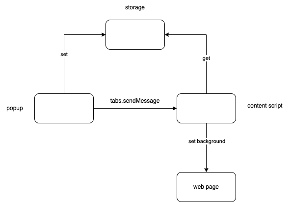

# 需求

1. 点击图片弹出一个popup页，一个输入框，一个按钮。输入框输入的是背景颜色，点击按钮，执行下面2的动作
2. 找到所有域名为extensions 官网文档网站下的tab，向其所在的content script发送消息
3. content script内监听消息，收到消息后，根据消息传来的数据，修改tab页的背景色
4. popup在点击按钮时，保存用户设置的颜色
5. content script在初始化时，从local取出颜色，设置背景色