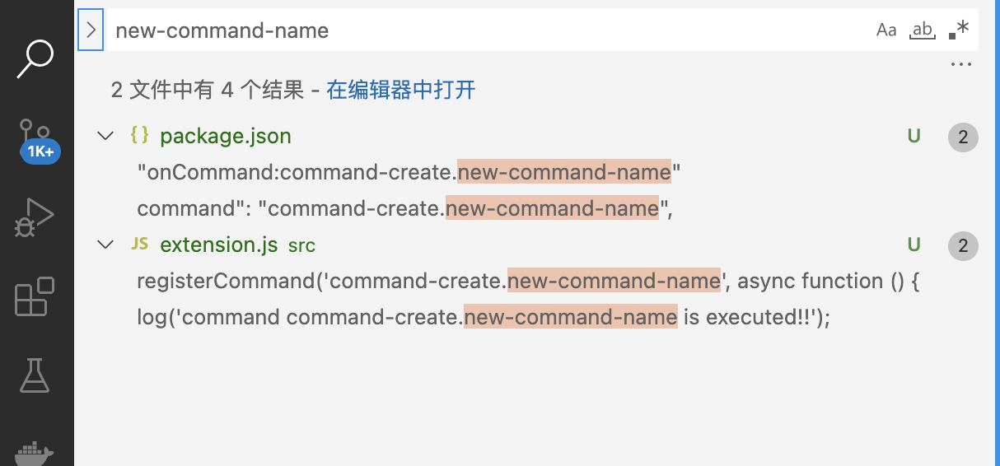
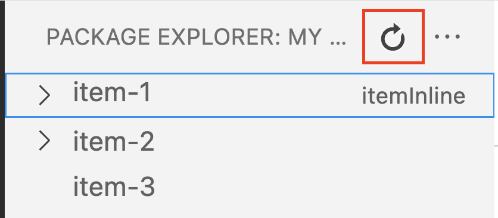
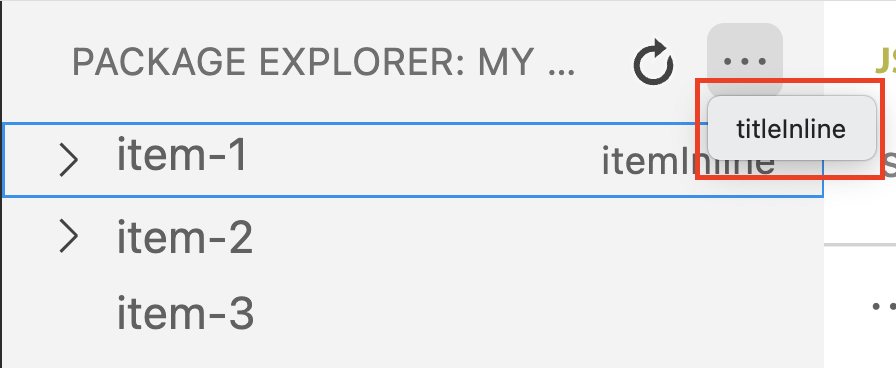
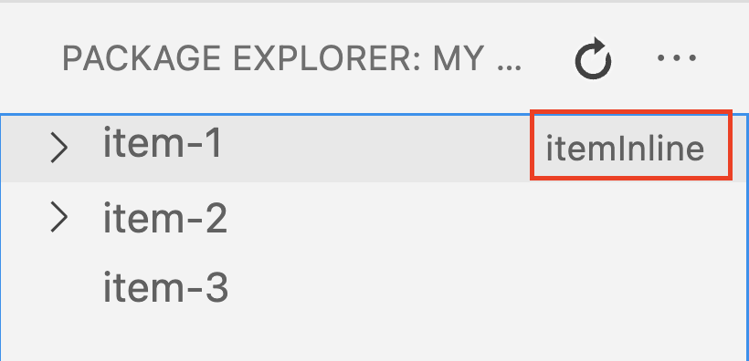
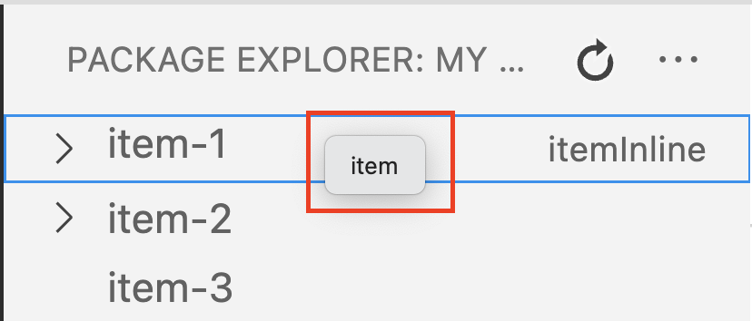

# vscode插件开发

### 基础开发-tree view

Tree View 就是在VS Code 侧边栏显示的树状结构。如下图

 
Tree View API 允许扩展在 Visual Studio Code 的侧边栏中显示内容

我们只需要按照下面的步骤，逐个实施，就能在侧边栏显示自己的Tree View了

#### 1. 创建视图
* 配置文件中声明插件包含Tree View

----> 代码操作`package.json`

通过配置`package.json`的`contributes.views.exploer`, 可以在vscode的exploer 内，显示我们的tree view，但是因为现在还没有数据，所以展开会报错

* 定义Tree Data Provider

参照sample源码讲解

* 定义Tree Item

参照sample源码讲解

* 注册Tree Data Provider

参照sample源码讲解

* 更新视图
    * 添加【刷新】按钮
      * 配置文件中声明
        
            1. 配置command
            2. 配置menu
            `package.json`的`menus.view/title.group`属性有两个值，navigation和inline，navigation是直接显示在进度条上，inline显示在右上角的菜单里
        

      * 绑定command的回调函数
        
        1. 
        onDidChangeEmitter = new vscode.EventEmitter();
        // 一个事件。通知Tree View更新。
        onDidChangeTreeData = this.onDidChangeEmitter.event;
        2.
        refresh() {
            // fire方法可以通知VS Code，view中有变化
            this.onDidChangeEmitter.fire();
        }
        3.
        vscode.commands.registerCommand('myTreeView.refresh', () => myViewProvider.refresh())
        

* 空视图的提示信息
当视图没有内容时，我们可以配置相应的提示信息，用来提示用户。

1. `package.json`中配置`contributes.viewsWelcome.view`和`contributes.viewsWelcome.contents`

* 创建View Container

package.json配置viewsContainers和views

 
#### 2. 视图的动作
* 实现：

与更新视图的实现类似，分别更新以下

  1. 追加`package.json`的`command`字段

{
    "command": "myTreeView.refresh",
    "title": "Refresh",
    "icon": {
        "dark": "resources/dark/refresh.svg",
        "light": "resources/light/refresh.svg"
    }
}

  2. 追加`package.json`的`menu`字段

{
    "view/title": [
        {
            "command": "myTreeView.refresh",
            "when": "view == myTreeView",
            "group": "navigation"
        }
    ]
}

  3. js文件中为commandId绑定回调函数

vscode.commands.registerCommand('myTreeView.refresh', () => myViewProvider.refresh())

* button在view中的位置:
  * view/title
    * "group": "navigation"
    
    * "group": "inline"
    
  * view/item/context
    * "group": "inline"
    
     * group不指定（鼠标右键）
     
* view中的item被选中

1. Tree Item的构造函数中，指定command属性。{command, title, description, tooltip, arguments}
2. package.json中配置command
3. js中注册回调，处理command

