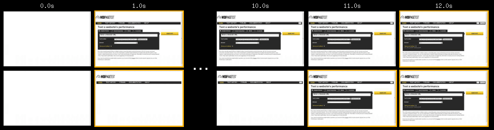
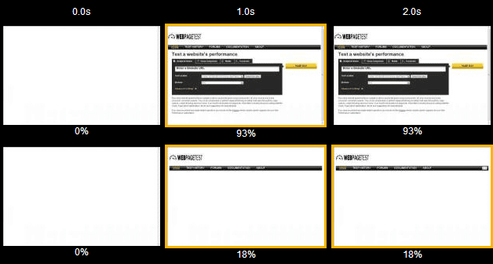
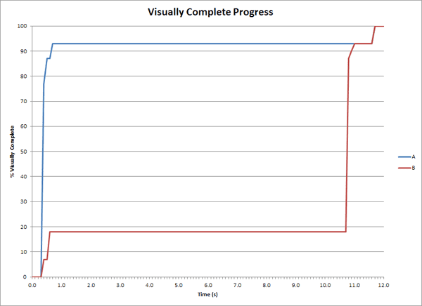
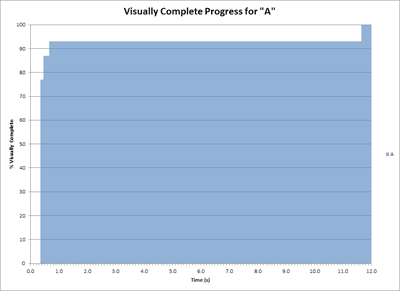
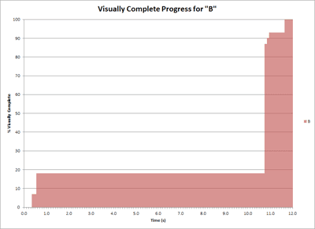
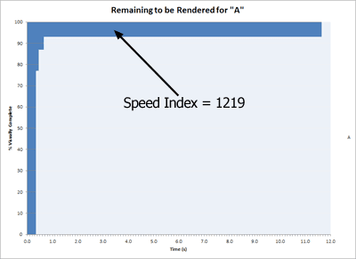
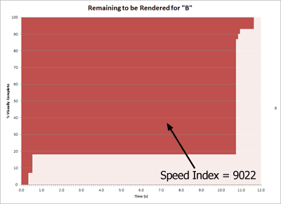

# 性能优化的指标和工具

### SI（Speed Index）

#### 概念
Speed Index 衡量页面加载期间内容以视觉方式显示的速度。

Speed Index 是一个用于衡量网页加载速度的性能指标，它可以测量网页内容在视觉上显示给用户所需的时间。它考虑了网页加载的时间、各个页面元素的渲染时间以及页面在加载过程中的视觉稳定性。

Speed Index 是网站所有者和开发人员需要考虑的重要指标，因为它对用户的参与度和满意度有着重要的影响。加载速度较慢的网站会导致高跳出率、转化率下降和搜索引擎排名下降。通过监测和优化 Speed Index，网站所有者可以改善整体用户体验并带来更好的业务结果。

#### 计算方法
Speed Index 的计算方式是通过分析页面加载过程的视频，并根据视觉内容的快速显示情况给出评分。评分越低，表示加载速度越快，用户体验越好；评分越高，表示加载速度越慢，用户体验越差。

需要注意的是，不同的工具和算法可能会对 Speed Index 的计算方式有所不同。因此，在使用 Speed Index 时应该了解具体的计算方法和工具使用要求，以确保获得准确的结果。

Speed Index 是通过分析网页加载过程的视频，并根据视觉内容的完成度情况计算得出的。具体步骤为:

1. 记录视频：

2. 计算帧数

将视频分解成一系列帧，每个帧表示网页在不同时间点的视觉内容（当前实现中每秒10帧）。

3. 计算视觉的完成度

对于每个帧，计算此时画面，与画面全部显示完成时，所占的百分比。

4. 根据各个帧的完成度，计算speed Index。

所以，即使两个页面他的FCP相同，页面完全显示的时间相同，speed index也未必相同。此时speed index越小，画面的显示内容的增加速率会越趋于平滑
#### 测量
* lighthouse

#### 影响因素

Speed Index 是衡量网页加载速度的指标，表示在页面加载过程中，用户能够看到多少内容以及看到内容的速度。以下是影响 Speed Index 的因素：

* 网页大小

网页大小是指网页中包含的所有资源的总大小，包括 HTML 文件、CSS 样式表、JavaScript 文件、图片、音视频等。网页大小越大，需要下载的资源就越多，加载时间也就越长，从而导致 Speed Index 变慢。

具体来说，当浏览器访问一个网页时，会首先下载 HTML 文件，然后解析 HTML 文件并下载其中引用的其他资源，如 CSS 样式表、JavaScript 文件、图片等。浏览器会按照下载的顺序来解析资源，如果某个资源下载时间过长，后续的资源就需要等待，导致整个页面的加载时间变慢。

* 服务器响应时间

服务器响应时间是指浏览器向服务器发送请求后，服务器处理请求并返回响应的时间。服务器响应时间长会导致网页加载速度变慢，从而影响 Speed Index。

* 图片大小

图片优化是指通过一系列的方法来减小图片文件的大小，从而减少网页加载时间，提高 Speed Index。

以下是一些常用的图片优化方法：

1. 压缩图片：可以使用各种工具（如 Photoshop、TinyPNG、Kraken.io）来压缩图片。压缩可以减小文件大小，从而减少下载时间。注意不要压缩过度，以免影响图片质量。

2. 使用适当的图片格式：不同的图片格式适用于不同的场景。例如，JPEG 格式通常用于照片，PNG 格式用于图形，GIF 格式用于动画。

3. 缩小图片尺寸：对于大尺寸图片，可以缩小图片尺寸来减小文件大小。但是要注意不要缩小过度，以免影响图片质量。

4. 裁剪图片：可以将不必要的部分从图片中裁剪掉，从而减小文件大小。

5. 使用 CSS Sprites：可以将多个小图片合并为一张大图片，从而减少 HTTP 请求次数。

6. 使用 lazy loading：可以延迟加载图片，当用户滚动到图片所在的位置时再进行加载，从而减少页面加载时间。

7. 使用 WebP 格式：WebP 格式是由 Google 开发的一种新型图片格式，具有更高的压缩比和更小的文件大小，从而可以提高网页加载速度。

* JavaScript 执行时间

JavaScript 执行时间是指从浏览器开始解析 JavaScript 文件，到执行完所有 JavaScript 代码的时间。JavaScript 执行时间长会导致网页加载速度变慢，从而影响 Speed Index。

以下是一些可以优化 JavaScript 执行时间的方法：

1. 减少 JavaScript 文件大小：可以通过压缩 JavaScript 文件、去除注释、删除不必要的代码等方法来减少 JavaScript 文件大小。

2. 将 JavaScript 代码移动到底部：将 JavaScript 代码放在文档底部，可以让页面其他内容优先加载，从而提高用户体验。

3. 使用异步加载：可以使用 async 和 defer 属性来异步加载 JavaScript 文件。async 属性表示该文件是异步加载的，不会阻塞页面其他资源的加载；defer 属性表示该文件在页面解析完毕后才会执行。

4. 使用 Web Workers：Web Workers 是浏览器提供的一种多线程机制，可以在后台运行 JavaScript 代码，从而避免 JavaScript 执行时间过长导致的页面卡顿。

5. 避免使用循环：循环会增加 JavaScript 执行时间，可以使用数组的 map、reduce、filter 方法等代替循环。

6. 减少 DOM 操作：DOM 操作会导致页面重排和重绘，从而增加 JavaScript 执行时间。可以尽可能地减少 DOM 操作次数。

7. 避免使用全局变量：全局变量会占用大量内存，从而增加 JavaScript 执行时间。可以使用闭包或者模块化的方式来封装代码，避免使用全局变量。

综上所述，JavaScript 执行时间是影响 Speed Index 的重要因素之一，通过优化 JavaScript 执行时间可以加快网页加载速度，提高用户体验。

