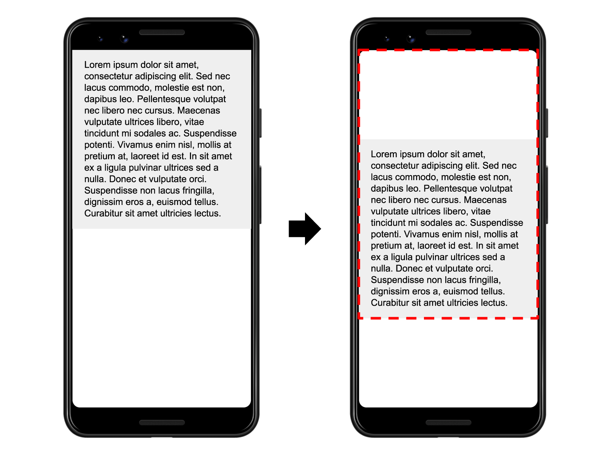

# 性能优化的指标和工具

### CLS（Cumulative Layout Shift）

累积布局偏移 (CLS) 是测量视觉稳定性的一个以用户为中心的重要指标，因为该项指标有助于量化用户经历意外布局偏移的频率，较低的 CLS 有助于确保一个页面是令人愉悦的。

我们应该都有过类似的经历：

在网上阅读一篇文章，结果页面上的某些内容突然发生改变？文本在毫无预警的情况下移位，导致您找不到先前阅读的位置。或者更糟糕的情况：您正要点击一个链接或一个按钮，但在您手指落下的瞬间，诶？链接移位了，结果您点到了别的东西！

页面内容的意外移动通常是由于异步加载资源，或者动态添加 DOM 元素到页面现有内容的上方。罪魁祸首可能是未知尺寸的图像或视频、实际渲染后比后备字体更大或更小的字体，或者是动态调整自身大小的第三方广告或小组件。

让这个问题变得更加棘手的是，网站在开发环境中的运作方式通常与用户在网站上的实际体验大不相同。个性化或第三方内容在开发环境中的表现通常与其在实际情况中的表现不同，测试图像通常已经在开发者的浏览器缓存中了，并且本地调用 API 的速度一般非常快，几乎察觉不到延迟。

累积布局偏移 (CLS) 指标通过测量真实用户体验中发生偏移的频率来帮助您解决这一问题。

#### 概念
CLS 测量整个页面生命周期内发生的所有意外布局偏移中最大一连串的布局偏移分数。
* 布局偏移

每当一个可见元素的位置从一个已渲染帧变更到下一个已渲染帧时，就发生了布局偏移 。
其实说白了，就是元素位置发生了变化。

* 一连串的布局偏移

一连串的布局偏移，也叫会话窗口，是指一个或多个快速连续发生的单次布局偏移，每次偏移相隔的时间少于 1 秒，且整个窗口的最大持续时长为 5 秒。

最大的一连串是指窗口内所有布局偏移累计分数最大的会话窗口。

#### 计算方法
`布局偏移分数 = 影响分数 * 距离分数`
  * 影响分数

在上图中，有一个元素在一帧中占据了一半的可视区域。接着，在下一帧中，元素下移了可视区域高度的 25%。红色虚线矩形框表示两帧中元素的可见区域集合，在本示例中，该集合占总可视区域的 75%，因此其影响分数为0.75 。

  * 距离分数

在上方的示例中，最大的可视区域尺寸维度是高度，不稳定元素的位移距离为可视区域高度的 25%，因此距离分数为 0.25。

所以，在这个示例中，影响分数是0.75 ，距离分数是0.25 ，所以布局偏移分数是0.75 * 0.25 = 0.1875 。

下面是另外一个计算布局便宜分数的例子：

绿色区域50%，下移20%

#### 预期布局偏移 vs. 意外布局偏移
* 由用户发起的布局偏移

布局偏移只有在用户并不期望其发生时才算是坏事。换言之，对用户交互（单击链接、点选按钮、在搜索框中键入信息等）进行响应的布局偏移通常没有问题，前提是偏移发生的时机与交互时机足够接近，使用户对前后关系一目了然。

例如，如果某次用户交互触发了一个网络请求，而该请求可能需要一段时间才能完成，那么最好立即留出一些空间并显示加载指示器，避免在请求完成时出现令用户不快的布局偏移。如果用户没有意识到当前正在加载某些内容，或者不知道资源什么时候能够准备就绪，他们就可能会在等待期间尝试点击其他内容（来打破僵局）。

在用户输入 500 毫秒内发生的布局偏移会带有hadRecentInput标志，便于在计算中排除这些偏移。

* 动画和过渡

动画和过渡如果做得好，确实是一个在更新页面内容时不让用户感到突兀的好方法。页面内容突然发生意外偏移几乎无一例外会造成糟糕的用户体验。但如果内容从一个位置逐步又自然地移动到下一个位置，这通常有助于用户更好地明白当前状况，并引导他们适应状态之间的变化。

CSS transform属性使您能够在不触发布局偏移的情况下为元素设置动画：

* 用transform: scale()来替代和调整height和width属性。
* 用transform: translate()来替代和调整top、right、bottom或left属性。

#### 测量
* lighthouse
* api
* web-vitals

#### 影响因素
* 加载图片
* 动态插入DOM节点
* 加载字体

字体加载的延迟，可能会，导致当页面上的字体没有及时加载时，浏览器可能会使用默认字体来呈现文本，字体加载完成后，会引起页面中文字显示的变化，从而导致layout发生偏移，影响了CLS

