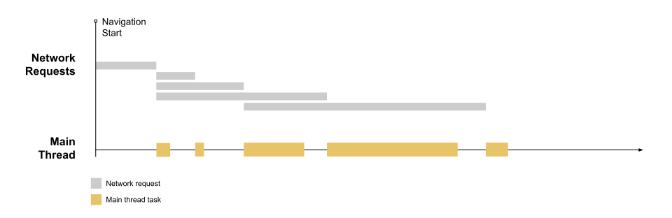

# 性能优化的指标和工具

### FID (First Input Delay)

首次输入延迟 (FID) 是测量加载响应度的一个以用户为中心的重要指标，因为该项指标将用户尝试与无响应页面进行交互时的体验进行了量化，低 FID 有助于让用户确信页面是有效的。

我们都知道给人留下良好的第一印象是多么重要。这不仅对于结识新朋友十分重要，在网络上塑造体验时也同样重要。
在网络上，良好的第一印象能够决定人们会成为忠实用户，还是从此一去不回头。问题在于，什么样的体验能留下良好印象，而您又要如何衡量您给用户留下了怎样的印象？
在网络上，第一印象可以有很多不同的形式，我们会对网站的设计和视觉吸引力形成第一印象，也会对网站的速度和响应度形成第一印象。
虽然很难通过网页 API 来衡量用户对网站设计的喜爱程度，但网页 API 却可以轻松测量网站速度和响应度！
用户对您的网站加载速度的第一印象可以通过First Contentful Paint 首次内容绘制 (FCP)进行测量。但是，您的网站在屏幕上绘制像素的速度只是其中一部分，同样重要的还有当用户试图与这些像素进行交互时，您的网站响应度有多高！
首次输入延迟 (FID) 指标有助于衡量您的用户对网站交互性和响应度的第一印象。

#### 概念
FID 测量从用户第一次与页面交互，直到浏览器对交互作出响应，并实际能够开始处理事件处理程序所经过的时间。

这里的页面交互，可以是，单击链接、点按按钮等等
下图是一个网页加载时间轴的示例

* 网页加载时间轴

该图显示的是一个页面，该页面正在发出数个网络请求来获取资源（多为 CSS 和 JS 文件），这些资源下载完毕后，会在主线程上进行处理。
这就导致主线程会阶段性地处于忙碌状态（在图中表示为米黄色任务块）。
较长的首次输入延迟通常发生在首次内容绘制 (FCP)和Time to Interactive 可交互时间 (TTI)之间，因为在此期间，页面已经渲染出部分内容，但交互性还尚不可靠。为了说明这种情况的发生缘由，我们在时间轴中加入了 FCP 和 TTI：

* 标记了FCP和TTI

我们注意到 FCP 和 TTI 之间有相当长的一段时间（包括三段长任务），如果用户在这段时间内尝试与页面进行交互（例如单击一个链接），那么从浏览器接收到单击直至主线程能够响应之前就会有一段延迟。

* 发生了First Input

因为输入发生在浏览器正在运行任务的过程中，所以浏览器必须等到任务完成后才能对输入作出响应。浏览器必须等待的这段时间就是这位用户在该页面上体验到的 FID 值。

#### 测量
* ##### 哪些算是首次输入？

FID 是测量页面加载期间响应度的指标。因此，FID 只关注不连续操作对应的输入事件，如点击、轻触和按键。
其他诸如滚动和缩放之类的交互属于连续操作，具有完全不同的性能约束（而且，浏览器通常能够通过在单独的线程上执行这些操作来隐藏延迟）。

* ##### 为什么只考虑首次输入？

虽然任何输入延迟都可能导致糟糕的用户体验，但我们还是被建议测量首次输入延迟，原因如下：
* 首次输入延迟将会是用户对您网站响应度的第一印象，而第一印象对于塑造我们对网站质量和可靠性的整体印象至关重要。
* 我们现如今在网络上看到的最大的交互性问题发生在页面加载期间。因此，首先侧重于改善网站的首次用户交互，这将对改善网络的整体交互性产生最大的影响。
* 我们推荐网站针对较高的首次输入延迟采取的解决方案（代码拆分、减少 JavaScript 的预先加载量等），不一定与针对页面加载后输入延迟缓慢的解决方案相同。通过分离这些指标，我们将能够为网页开发者提供更确切的性能指南。

* ##### 如果用户始终没有与您的网站进行交互怎么办？

并非所有用户都会在每次访问您的网站时进行交互。而且也并不是所有交互都与 FID 相关（如上一节所述）。此外，一些用户的首次交互会处于不利的时间段内（当主线程长时间处于繁忙时），而另一些用户的首次交互会处于有利的时间段内（当主线程完全空闲时）。

这意味着有些用户将没有 FID 值，有些用户的 FID 值较低，而有些用户的 FID 值可能较高。

因此，FID 是一个只能进行实际测量的指标，因为该项指标需要真实用户与您的页面进行交互。

* ##### 工具
  * PageSpeed Insights（生产环境工具，无法检查localhost的站点）
  * api
  * web-vitals
  * web-vitals Chrome插件

#### 影响因素
* JavaScript执行时间

当浏览器处理JavaScript时，它会阻塞主线程。如果JavaScript需要执行的时间很长，那么用户的交互就会被延迟。因此，减少JavaScript执行时间可以改善FID。

* 线程阻塞

浏览器主线程只有一个，当它被占用时，所有其他任务都需要等待它完成。如果主线程被占用的时间太长，那么FID就会受到影响。因此，避免使用会阻塞主线程的资源，如长时间的JavaScript、长时间的CSS动画或过多的第三方脚本等。

* 渲染时间

浏览器需要将网页渲染出来才能响应用户的交互。如果渲染时间过长，那么用户的交互就会被延迟。因此，优化网页渲染时间可以改善FID。

* 网络延迟

如果用户的设备与服务器之间的网络连接速度较慢，则会影响FID。因此，使用CDN（内容分发网络）和优化图片大小等措施可以改善网络延迟。

* 设备性能

如果用户设备的处理能力较弱，则会影响FID。因此，优化网页性能可以改善设备性能方面的问题。

